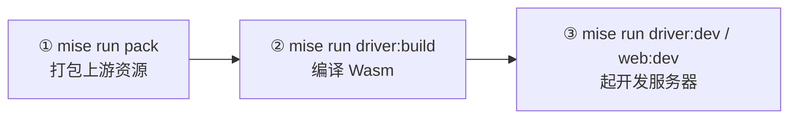

# Ubuntu 开发部署手册

> 面向在 Ubuntu 系统上进行本地开发和部署的实操指南：怎么装环境、怎么打包资源、怎么编译 Wasm、怎么跑起来、怎么跑测试、出问题怎么办。
>
> **优势**：Ubuntu 是 Linux 系统，hk 工具完全支持，可以直接使用 mise 命令，无需替代脚本。

---

## 1. 环境准备

### 1.1 前置依赖

| 依赖 | 说明 | 安装命令 |
|---|---|---|
| **mise** | 统一管理 deno / emsdk / cmake / ninja / hk / pkl 等版本，**必须** | 见下方安装步骤 |
| **build-essential** | C/C++ 编译工具链（gcc、g++、make） | `sudo apt install build-essential` |
| **curl** | 下载工具 | `sudo apt install curl` |
| **git** | 版本控制 | `sudo apt install git` |
| **pkg-config** | 编译依赖管理 | `sudo apt install pkg-config` |
| **libssl-dev** | OpenSSL 开发库 | `sudo apt install libssl-dev` |

### 1.2 安装 mise

```bash
# 方式 A：使用官方安装脚本（推荐）
curl https://mise.run | sh

# 方式 B：手动安装
curl -L https://github.com/jdx/mise/releases/latest/download/mise-linux-x64 -o ~/.local/bin/mise
chmod +x ~/.local/bin/mise
```

### 1.3 配置 Shell 集成

根据你使用的 shell 选择对应配置：

**Bash（Ubuntu 默认）**：
```bash
echo 'eval "$(mise activate bash)"' >> ~/.bashrc
source ~/.bashrc
```

**Zsh**：
```bash
sudo apt install zsh
echo 'eval "$(mise activate zsh)"' >> ~/.zshrc
source ~/.zshrc
```

> ⚠️ **实战踩坑：登录后 `mise: 找不到命令`**
>
> `curl https://mise.run | sh` 默认把 mise 装到 `/root/.local/bin/mise`，但这个目录**不在默认 PATH 里**。更关键的是：
> - **登录 shell 加载的是 `~/.profile`**（不是 `~/.bashrc`，除非 `~/.profile` 里显式 source 了 `~/.bashrc`）。
> - 只在 `~/.bashrc` 写 PATH，重新 SSH 登录时仍会报 `找不到命令 "mise"，但可以通过以下软件包安装它：snap install mise`。
>
> **正确做法**（实测有效），把 PATH 同时写进 `~/.profile`：
> ```bash
> echo 'export PATH="$HOME/.local/bin:$PATH"' >> ~/.profile
> echo 'eval "$(/root/.local/bin/mise activate bash)"' >> ~/.bashrc
> source ~/.profile
> mise --version   # 应输出版本号，如 2026.8.16 linux-x64
> ```
> 下次纯 SSH 登录（非交互子 shell）也能直接 `mise`。

### 1.4 克隆项目

```bash
# 克隆项目（包含子模块）
git clone --recurse-submodules <repository-url>
cd poe1-pob-web

# 如果已克隆但缺子模块，用以下命令补
git submodule update --init --recursive
```

### 1.5 首次初始化

```bash
# 安装所有工具和依赖
mise run setup
```

这个命令会：
1. `deno ci` —— 按 `deno.lock` 安装全部依赖
2. `git submodule update --init --recursive` —— 拉取 Lua 运行时
3. `hk install --mise` —— 安装 pre-commit 钩子（deno fmt / lint / check）

**验证工具链**：
```bash
mise --version && deno --version   # deno 应为 2.9.3
```

### 1.6 （实战）服务器下载慢：用本机代理加速

如果 Ubuntu 服务器在国内网络，克隆 Git 子模块、拉 mise 工具链、装 deno 依赖都很慢，可用 **SSH 反向隧道**把本机（macOS/Windows）的代理"借"给服务器用。

> ⚠️ **关键限制：隧道和要用代理的命令必须在同一个 SSH 会话里。**
> 不能"一边 `ssh -R` 建隧道、另一边新开 SSH 跑命令"——那样新会话访问不到隧道端口，会报 `Connection refused`。
> 即在**建隧道的那个 SSH 窗口里**继续敲后续命令。

**步骤**：

1. **在本机终端建反向隧道**（保持窗口打开）。假设本机代理是 Clash Verge 的 `127.0.0.1:7897`：
   ```bash
   # 本机执行
   ssh -R 7897:127.0.0.1:7897 root@<server-ip>
   ```
   参数含义：把服务器的 `7897` 端口转发到本机 `127.0.0.1:7897`（你的代理）。

2. **在同一个 SSH 会话里**设代理并验证：
   ```bash
   export PATH="$HOME/.local/bin:$PATH"
   export HTTP_PROXY="http://127.0.0.1:7897"
   export HTTPS_PROXY="http://127.0.0.1:7897"
   curl -I https://github.com        # 应返回 HTTP/2 200
   ```

3. **接着跑初始化**（同一个会话）：
   ```bash
   cd /opt/poe/poe1-pob-web
   git submodule update --init --recursive   # 走代理，速度正常
   mise run setup
   ```

> 💡 也可把上面的初始化步骤整成 `代码阅读/scripts/setup-ubuntu-with-proxy.sh`，建好隧道后在服务器直接 `bash setup-ubuntu-with-proxy.sh`。

---

## 2. 三步跑起来

本地开发有严格的先后顺序：**先打包资源 → 再编译 Wasm → 最后起开发服务器**。



### ① 打包上游资源

开发服务器默认从本地 `packages/packer/r2/` 读取资源（Vite 的 `/@fs/` 虚拟路径）。**没打包就起服务会直接报资源加载失败**。

```bash
# driver:dev 的默认值是 poe2 / v0.8.0，所以至少要先打这一个
mise run pack --game poe2 --tag v0.8.0
```

各游戏当前默认版本（取自 `version.json` 的 `head`）：

| 游戏 | head 版本 | 打包命令 |
|---|---|---|
| poe1 | `v2.67.2` | `mise run pack --game poe1 --tag v2.67.2` |
| poe2 | `v0.23.1` | `mise run pack --game poe2 --tag v0.23.1` |
| le | `v0.12.0` | `mise run pack --game le --tag v0.12.0` |

> 注意 `driver:dev` 未指定版本时用的是 **vite.config.ts 里的默认值 `poe2 / v0.8.0`**，与 `version.json` 的 head 不同。想跑最新版请显式传 `--version`。

产物位置：

```
packages/packer/r2/games/<game>/versions/<tag>/
├── root.zip          # Lua、配置等（打进 zip 供 zenfs 只读挂载）
└── root/             # 图片、DDS 纹理（走 HTTP 单独加载）
```

打包有输入指纹缓存，重复执行且输入未变会直接复用。

**跳过打包**：加 `--pob-cool-asset` 直接用线上 CDN `asset.pob.cool`（需要联网，速度取决于网络）：

```bash
mise run web:dev --pob-cool-asset
mise run driver:dev --game poe2 --version v0.23.1 --pob-cool-asset
```

### ② 编译 Wasm driver

```bash
mise run driver:build          # 同时产出 debug + release
```

底层是 `emcmake cmake --fresh -G Ninja` + `emmake ninja`（`tools/tasks/main.ts` 的 `buildDriver`），产物：

```
packages/driver/dist/debug/     driver.mjs + driver.wasm        （-O0 -g3，开启 ASSERTIONS/SAFE_HEAP）
packages/driver/dist/release/   driver.mjs + driver.wasm + driver.wasm.debug.wasm（-O3，LTO，mimalloc）
```

只编译其中一个变体（mise 任务未暴露 flag，走底层命令）：

```bash
deno task repo driver-build --kind debug
deno task repo driver-build --kind release
```

**何时需要重编译**：改动 `packages/driver/src/c/**`、`packages/driver/boot.lua`、`vendor/lua/**` 之后。
只改 `packages/driver/src/js/**` 不需要重编译，Vite HMR 会直接生效。

> `mise run driver:dev` / `web:dev` / `web:build` / 各 E2E 任务都在 `depends` 里声明了 `driver:build`，会按需自动编译，一般不用手动跑。

### ③ 起开发服务器

**方式 A：只跑 driver（最快，改渲染/输入时推荐）**

```bash
mise run driver:dev --game poe2 --version v0.8.0
mise run driver:dev --game poe1 --version v2.67.2 --build debug   # 用 debug 版 Wasm
```

**方式 B：跑完整 Web 应用（改前端/路由/登录时推荐）**

```bash
mise run web:dev
```

它会同时启动三个进程：

| 进程 | 作用 | 端口 |
|---|---|---|
| Vite / React Router dev | 前端 | 动态分配 |
| Wrangler Pages dev | `/api/*`（CORS 代理、KV） | 动态（自动转发到 Vite） |
| Wrangler inspector | Workers 调试 | 动态 |

**端口是动态分配的**，从终端输出里找 `Local: http://127.0.0.1:xxxx/` 打开。

**方式 C：手机真机测试**

```bash
mise run web:dev:public
```

通过 Pinggy 生成临时公网 HTTPS URL（每次都变、无鉴权）。**不要把私人构筑码或凭证放进去**。运行时诊断以 JSONL 输出到 stderr，可按 `runId` 过滤。

---

## 3. 测试

### 3.1 分层总览

| 层级 | 命令 | 跑什么 | 何时跑 |
|---|---|---|---|
| 静态检查 | `mise run check` | `deno fmt --check`、`deno lint`、`deno check`、react-router typegen | 每次提交前 |
| 自动修复 | `mise run fix` | `deno fmt` / `deno lint --fix` | 提交前 |
| driver 单测 | `mise run test:driver` | `deno test test/unit/*.test.ts` + `ctest`（C 桥接测试） | 改 driver 逻辑 |
| web 单测 | `mise run test:web` | `deno test test/unit/*.test.ts` | 改 web 逻辑 |
| zenfs 集成 | `mise run test:integration:zenfs` | 浏览器与 Wrangler 环境下的文件系统后端 | 改 fs 相关 |
| driver E2E | `mise run test:e2e:driver` | Chromium + Firefox 真跑 PoB | 改渲染/输入/启动 |
| web E2E | `mise run test:e2e:web` | 落地页 → 版本加载 → driver 会话 | 改路由/前端集成 |
| 完整校验 | `mise run test` | 以上全部 + 工具自测 + 生产构建校验 | **提交 PR 前必跑** |

### 3.2 静态检查与格式化

```bash
mise run check                                # 全量
mise run check packages/driver/src/js/draw.ts # 只查改动文件
mise run fix                                  # 自动修复
```

检查项由 `hk.pkl` 定义，`pre-commit` 钩子会自动跑（带 `fix = true`，会自动格式化后重新暂存）。

### 3.3 单元测试

```bash
mise run test:driver   # Driver 包：Deno 单测 + CTest（C 层的 bridge_test）
mise run test:web      # Web 包：Deno 单测
```

在 VS Code 里跑单个测试文件（Deno 扩展提供 CodeLens）：

```bash
cd packages/driver && deno test --no-check --allow-env --allow-read test/unit/draw.test.ts
```

也可以直接用 VS Code 的测试面板，或直接点 `.test.ts` 里 `Deno.test` 上方的 **▶ Run Test**。

### 3.4 浏览器 E2E

首次需要安装浏览器：

```bash
mise run visual:setup          # chromium + firefox + webkit（也供 investigate-canvas-ui 使用）
mise run benchmark:setup       # 只装 chromium + firefox（做基准测试用）
```

跑 E2E（**会自动先打包所需资源**，无需手动 pack）：

```bash
mise run test:e2e:driver                            # 三款游戏的 head 版本，Chromium + Firefox
mise run test:e2e:driver --game poe2                # 只跑 poe2 的 head
mise run test:e2e:driver --game poe1 --version v2.67.2   # 指定版本
mise run test:e2e:driver:bc7                        # BC7 CPU 回退路径（强制关闭 BPTC）
mise run test:e2e:web                               # 落地页 → driver 的关键路径
```

driver E2E 检查项覆盖：物品数据库加载、Wasm 启动、WebGL2 渲染、帧统计、剪贴板往返、DOM 缩放控件。

装了 Playwright 扩展的话，也可以在 VS Code 测试面板里选择 `chromium` / `firefox` 项目单独跑。

### 3.5 完整校验（PR 前）

```bash
mise run test
```

按序执行：

```
check → test:driver → test:integration:zenfs → test:web
     → test:sentry-upload（工具自测）→ test:upstream-sync（工具自测）
     → test:driver:debuginfo（Wasm 调试符号校验）→ web:build（生产构建）
     → verifyWebBuild（校验 Sentry application key 已注入、无 debug sidecar 泄漏）
```

耗时较长，建议放到提交 PR 前跑。

### 3.6 基准测试

```bash
mise run benchmark:setup
mise run benchmark:driver     # poe1 / v2.66.2 / release，Chromium 与 Firefox 各取 5 次稳态帧中位数
```

### 3.7 并行注意事项

共享 `deno ci` 的任务（几乎所有任务都依赖 `install`）**不要同时开两个**。要并行，先单独跑一次 `mise run install` 完成依赖安装，再并行下游任务。

---

## 4. 常用环境变量

在终端里 export，或写入 `mise` 的 env 文件：

| 变量 | 作用 | 示例 |
|---|---|---|
| `RUN_GAME` | driver:dev / E2E 跑哪个游戏 | `poe1` / `poe2` / `le` |
| `RUN_VERSION` | driver:dev / E2E 跑哪个上游版本 | `v2.67.2` |
| `RUN_BUILD` | 用 debug 还是 release 的 Wasm | `debug` / `release` |
| `POB_COOL_ASSET` | 用线上 CDN 资源替代本地打包 | `true` |
| `BPTC_SUPPORT_OVERRIDE` | 强制关闭 BC7 硬件解码（测 CPU 回退） | `false` |
| `POB_RENDERING_MAX` | 限制最大渲染尺寸（dev 模式，`web:dev` 生效） | `2048` |
| `VITE_SENTRY_DSN` | 本地把 Sentry 事件发到指定 DSN | — |
| `MISE_ENV` | 站点 owner 专用，启用部署类任务 | `pob-cool` |
| `SENTRY_LIVE_*` | 验证 Wasm 符号化的测试专用变量（与部署凭证隔离） | — |

E2E 与 dev 的 `--game` / `--version` 参数最终就是转成 `RUN_GAME` / `RUN_VERSION` 注入 Vite 的 `define`。

---

## 5. 调试技巧

### 5.1 Wasm 调试

- **debug 构建**（`--build debug`）带 `-g3 -sASSERTIONS=1 -sSAFE_HEAP=1 -sSTACK_OVERFLOW_CHECK=2`，Chrome DevTools 可直接看 C 源码级断点。
- **release 构建**用 `-gseparate-dwarf`，DWARF 抽到 `driver.wasm.debug.wasm` 旁车文件，生产产物体积小且能配合 Sentry 符号化。
- 故意触发崩溃验证符号化链路：`sentry_test_crash()` → `mise run test:sentry:live`。

### 5.2 运行时诊断

`web:dev`（development 模式）会通过 `diagnosticsDevPlugin` 把结构化诊断事件以 **JSONL 输出到开发服务器 stderr**，按 `runId` 过滤即可跟踪单次会话。覆盖 driver / worker / canvas / webgl / frame / asset 各阶段。

### 5.3 性能面板

driver overlay 里的性能浮层显示实时帧时间、图层数、实例数、dispatch 数、字形图集占用。也可通过前端设置弹窗开关。

### 5.4 Canvas / 渲染问题

Canvas 与 WebGL 的行为不适合用 DOM 断言验证。仓库提供 `investigate-canvas-ui` skill（Playwright MCP + Vision Mode）做视觉排查：

```bash
mise run visual:setup          # 首次
mise run playwright:mcp        # 启动带 Vision 的 MCP（默认 headless）
```

需要可见浏览器时设 `PLAYWRIGHT_MCP_HEADED=1`。

### 5.5 Vite 插件检查

driver 与 web 都启用了 `vite-plugin-inspect`，开发时可访问 `http://127.0.0.1:<port>/__inspect/` 查看插件流水线。

---

## 6. 常见问题

### 6.1 起服务就报资源加载失败 / `Failed to load root.zip`

本地开发默认读 `packages/packer/r2/`。先打包对应版本，或改用 `--pob-cool-asset` 走 CDN。

### 6.2 报 `SharedArrayBuffer is not defined` / `PobEnvironmentCapabilityError`

运行时依赖 cross-origin isolation。开发服务器已自动加 `COOP: same-origin` + `COEP: require-corp` 头（driver 在 `vite.config.ts`，web 在自定义中间件里，但 `/auth/poe-popup` 例外）。必须通过 `http://127.0.0.1` 或 HTTPS 访问，**不能用局域网 IP 直连**。

> ⚠️ **实战踩坑（远程服务器）**：在 Ubuntu 服务器上跑 `mise run driver:dev`，然后浏览器用 `http://<server-ip>:5173/` 访问，会直接报：
> ```
> Driver startup failed PobEnvironmentCapabilityError:
> Path of Building requires cross-origin isolation and SharedArrayBuffer support
> ```
> 原因是浏览器只有在 **安全上下文**（HTTPS 或 `localhost`/`127.0.0.1`）里才允许 `SharedArrayBuffer`，**单纯 IP 地址不算安全上下文**。
>
> **给 Vite 加 `--host` 暴露到 `0.0.0.0` 也救不了**——这只能让端口被外部访问，改不了"浏览器是否处于 isolated 上下文"。不要为了这个去改 `packages/driver/deno.json` 的 `dev` 任务（已验证无效，并已改回原样 `"dev": "vite"`）。
>
> ✅ **正确做法：本地端口转发**。在**本机**另开一个终端建 SSH 本地隧道，把服务器 5173 转到本机：
> ```bash
> # 本机执行
> ssh -L 5173:127.0.0.1:5173 root@<server-ip>
> ```
> 然后浏览器访问 **`http://localhost:5173/`**。`localhost` 满足 cross-origin isolation，启动正常。
>
> 同理 `web:dev` 暴露多个动态端口时，可对每个端口各建一条 `-L` 转发。

### 6.3 想在 VS Code 里用 CMake 面板构建

不建议。Wasm 构建走的是 `emcmake` / `emmake` 包装（Emscripten 的工具链文件），普通 CMake configure 会失败。请在集成终端用 `mise run driver:build`。

### 6.4 PoB 里导入角色一直失败 / 提示 POESESSID

设计如此。`rpc.ts` 的 `prepareFetchHeaders` 会无条件拒绝任何含 `POESESSID` 的请求。**不要在本站点输入 POESESSID**。网络走的是 `/api/fetch` CORS 代理，所有用户共用出口 IP，容易触发官方限流。

### 6.5 编译很慢

release 构建开了 LTO + `-O3`，首次耗时长属正常。只调试 JS/渲染逻辑时用 `--build debug` 或直接依赖 HMR，避免反复重编译。

### 6.6 修改了 C 代码但没生效

`mise run driver:build` 会 `cmake --fresh` 重建。若仍怀疑缓存，手动清理：

```bash
rm -rf packages/driver/build packages/driver/dist
mise run driver:build
```

### 6.7 提交时钩子报格式错误

`hk` 的 pre-commit 带 `fix = true`，会自动格式化并把修复结果重新暂存。若仍有残留错误，手动跑 `mise run fix` 后重新 `git add`。

### 6.8 任务端口冲突 / 想同时开多个服务

Vite、Wrangler、inspector 的端口都是动态分配的，可并存。并行跑任务前先单独执行一次 `mise run install`。

### 6.9 Ubuntu 特有：权限问题

如果遇到权限问题，确保用户有权限访问项目目录：

```bash
# 确保用户有权限
sudo chown -R $USER:$USER ~/path/to/poe1-pob-web
```

### 6.10 Ubuntu 特有：缺少系统库

如果编译时报错缺少某些库，安装以下常用开发库：

```bash
sudo apt install -y build-essential \
    pkg-config \
    libssl-dev \
    libffi-dev \
    libgl1-mesa-dev \
    libglu1-mesa-dev \
    libx11-dev \
    libxext-dev \
    libxrender-dev
```

### 6.11 Git 子模块镜像坑（不要乱设 `insteadOf`）

如果图快给 Git 配过国内镜像：
```bash
git config --global url."https://github.com.cnpmjs.org/".insteadOf "https://github.com/"
```
**实测在走代理的场景下会失败**：`git submodule update` 报
```
fatal: 无法访问 'https://github.com.cnpmjs.org/atty303/lua.git/'：
gnutls_handshake() failed: The TLS connection was non-properly terminated.
```
因为镜像域名解析不到 / 代理下握手被中断。

✅ **正确做法**：走 §1.6 的 SSH 隧道代理，直接用 GitHub 官方地址，并清除镜像配置：
```bash
git config --global --unset url."https://github.com.cnpmjs.org/".insteadOf
git submodule update --init --recursive   # 走 HTTP(S)_PROXY，正常
```

---

## 7. 命令速查

```bash
# 环境
mise run setup                  # 首次初始化（依赖 + 子模块 + git hooks）
mise run install                # 只装/更新依赖
mise tasks                      # 查看全部可用任务

# 资源
mise run pack --game poe2 --tag v0.8.0

# 编译
mise run driver:build           # debug + release
deno task repo driver-build --kind debug
mise run web:build              # 前端生产构建

# 运行
mise run driver:dev --game poe2 --version v0.8.0
mise run web:dev
mise run web:dev --pob-cool-asset
mise run web:dev:public         # 公网隧道（无鉴权，慎用）

# 检查与测试
mise run check                  # 静态检查
mise run fix                    # 自动修复
mise run test:driver            # driver 单测 + CTest
mise run test:web               # web 单测
mise run test:integration:zenfs # 文件系统集成测试
mise run visual:setup           # 安装浏览器
mise run test:e2e:driver --game poe2
mise run test:e2e:driver:bc7
mise run test:e2e:web
mise run test                   # 完整校验（PR 前）

# 其他
mise run benchmark:driver       # 帧时间基准
mise run playwright:mcp         # 视觉排查
mise run test:sentry:live       # 验证 Wasm 符号化（需 SENTRY_LIVE_* 变量）
mise run upstream-sync:collect --game poe2    # 站点 owner：同步上游版本
```

---

## 8. 改动不同位置的推荐验证路径

| 你改了什么 | 最小验证 |
|---|---|
| `packages/driver/src/js/**`（渲染、输入、overlay） | `mise run driver:dev` → `mise run test:driver` → `mise run test:e2e:driver --game <game>` |
| `packages/driver/src/c/**`、`boot.lua` | `mise run driver:build` → `mise run driver:dev --build debug` → `mise run test:driver` |
| `packages/driver/src/js/fs.ts`、文件系统后端 | `mise run test:integration:zenfs` → `mise run test:e2e:web` |
| `packages/web/src/**`（路由、UI、设置） | `mise run web:dev` → `mise run test:web` → `mise run test:e2e:web` |
| `packages/web/functions/**`（API、KV） | `mise run web:dev`（wrangler dev 会加载）→ `mise run test:web` |
| `packages/packer/**` | 重新 `mise run pack`，确认 `root.zip` 与 `root/` 产物正确 |
| `tools/**` | `mise run test:upstream-sync` / `mise run test:sentry-upload` |
| 构建、包边界、CI、发布相关 | `mise run test`（完整） |

---

## 9. Ubuntu 与 macOS 的主要区别

| 项目 | macOS | Ubuntu |
|------|-------|--------|
| **包管理器** | Homebrew (`brew`) | apt (`apt` / `apt-get`) |
| **hk 工具支持** | ❌ 不支持 Intel Mac（darwin/amd64）<br>✅ 支持 Apple Silicon（darwin/arm64） | ✅ 完全支持 Linux |
| **mise 安装** | `brew install mise` | `curl https://mise.run \| sh` |
| **Shell 集成** | `~/.zshrc`（默认） | `~/.bashrc`（默认）或 `~/.zshrc` |
| **系统依赖** | Xcode Command Line Tools | `build-essential`、`pkg-config` 等 |
| **替代脚本** | 需要（因 hk 不支持 darwin/amd64） | 不需要（可直接使用 mise 命令） |

---

## 10. 生产部署

### 10.1 构建生产版本

```bash
# 编译 Release 版本 Wasm
mise run driver:build

# 构建前端
mise run web:build
```

### 10.2 部署到 Cloudflare Pages

```bash
# 部署（需要 Cloudflare 账号和权限）
mise run web:deploy
```

### 10.3 Docker 部署（可选）

如果需要容器化部署，可以创建 Dockerfile：

```dockerfile
FROM denoland/deno:2.9.3

# 安装系统依赖
RUN apt-get update && apt-get install -y \
    build-essential \
    cmake \
    ninja-build \
    git \
    curl \
    && rm -rf /var/lib/apt/lists/*

# 安装 mise
RUN curl https://mise.run | sh

# 设置工作目录
WORKDIR /app

# 复制项目文件
COPY . .

# 初始化环境
RUN mise run setup

# 构建
RUN mise run driver:build
RUN mise run web:build

# 暴露端口
EXPOSE 3000

# 启动命令（根据实际需求调整）
CMD ["mise", "run", "web:dev"]
```

---

## 11. 性能优化建议

### 11.1 编译优化

- **使用 Release 版本**：日常开发建议用 Release 版本，性能提升 3-5 倍
- **并行编译**：如果 CPU 核心多，可以设置 `CMAKE_BUILD_PARALLEL_LEVEL` 环境变量

### 11.2 运行时优化

- **使用 CDN 资源**：`--pob-cool-asset` 参数可以跳过本地打包，直接使用 CDN
- **浏览器选择**：Chrome/Edge 对 Wasm 优化最好
- **关闭调试工具**：生产环境关闭 React DevTools 和 Vue DevTools

### 11.3 系统优化

```bash
# 增加文件描述符限制（如果遇到 "too many open files" 错误）
ulimit -n 65536

# 永久设置，添加到 ~/.bashrc
echo "ulimit -n 65536" >> ~/.bashrc
```

---

## 12. 故障排查

### 12.1 日志查看

```bash
# 查看 Vite 开发服务器日志
# 日志会直接输出到终端

# 查看 Wrangler 日志
# 日志会输出到终端的 stderr
```

### 12.2 清理缓存

```bash
# 清理 Deno 缓存
rm -rf node_modules
deno cache --reload

# 清理构建产物
rm -rf packages/driver/build packages/driver/dist
rm -rf packages/packer/build packages/packer/r2
rm -rf packages/web/build packages/web/.vite packages/web/.wrangler

# 重新初始化
mise run setup
```

### 12.3 网络问题

如果在中国大陆访问 GitHub 或 CDN 较慢，可以配置代理：

```bash
# 设置代理（根据你的代理配置调整）
export HTTP_PROXY=http://127.0.0.1:7897
export HTTPS_PROXY=http://127.0.0.1:7897

# 或配置 git 代理
git config --global http.proxy http://127.0.0.1:7897
git config --global https.proxy http://127.0.0.1:7897
```

---

## 13. 相关文档

- [本地开发手册（macOS）](./本地开发手册.md) - macOS 系统的开发指南
- [代码分析](./代码分析.md) - 项目架构和代码分析
- [工具介绍](./工具介绍.md) - 项目工具链说明
- [scripts/README.md](./scripts/README.md) - macOS 替代脚本说明（Ubuntu 不需要）