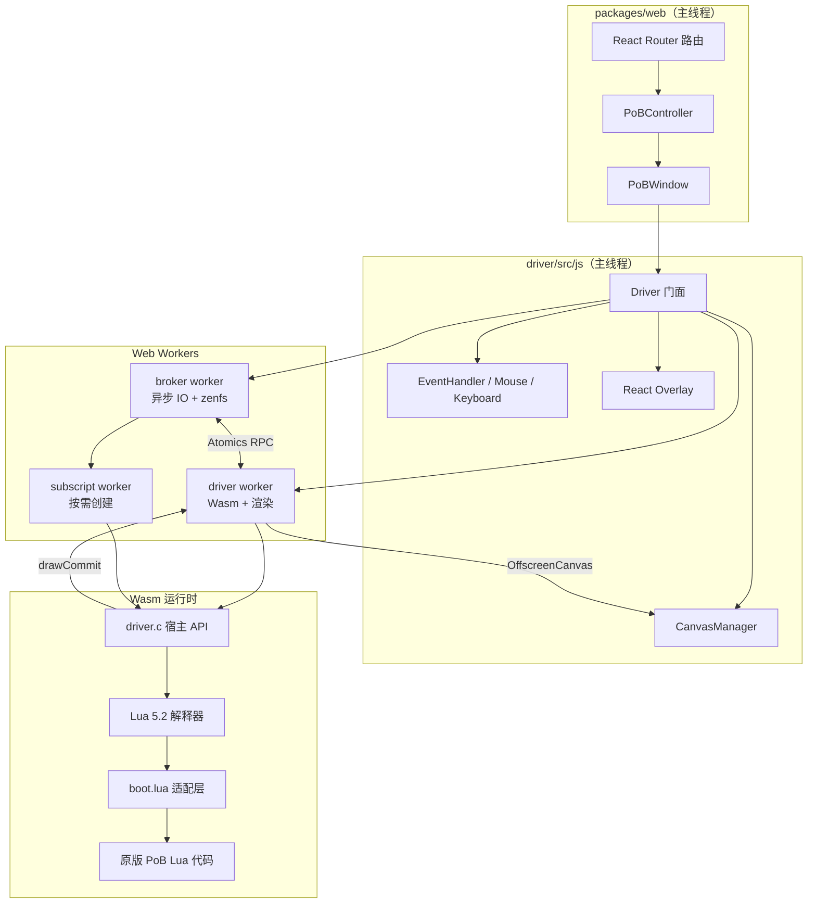
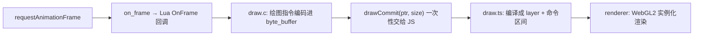

# pob.cool 代码分析

> 本文基于 `dev` 分支代码走查整理，目标是帮助新读者在最短时间内理解：这个项目是什么、怎么跑起来的、代码在哪、改代码要注意什么。

## 0. 三分钟速览

**项目是什么**：把桌面版 [Path of Building](https://pathofbuilding.community/)（流放之路的离线构筑规划器）**原封不动**搬进浏览器运行的 Web 应用，线上站点 https://pob.cool。

**核心手段**：用 Emscripten 把一个 Lua 5.2 解释器编译成 WebAssembly，再用 C + JavaScript 重新实现 PoB 依赖的宿主接口（图形、文件、网络、剪贴板），让原版 Lua 代码"以为"自己还在 Windows 上运行。

**铁律**：**一行上游 PoB 代码都不改**。所有浏览器特化行为只能写在适配层（`boot.lua` / C 桥接层 / JS 驱动）。

**支持的游戏**：Path of Exile 1、Path of Exile 2、Last Epoch。

**技术栈**：Deno workspace + TypeScript + C/Emscripten + Lua + React Router v7 + Cloudflare Pages/Workers + WebGL2。

---

## 1. 目录结构

```
poe1-pob-web/
├── deno.json                 # Deno workspace 定义（5 个包）+ 依赖版本 + 全局任务
├── mise.toml                 # 所有开发/测试/构建任务的唯一入口
├── version.json              # 每个游戏的当前 head 版本、历史版本、兼容性测试结果
├── docs/adr/                 # 架构决策记录（必读）
│   ├── 0001-async-runtime-and-sjlj.md   # 为什么用 Atomics RPC 而不是 Asyncify
│   └── 0002-render-backend-boundary.md  # 渲染后端边界
├── packages/
│   ├── dds/                  # DDS/BC7 纹理格式解析
│   ├── driver/               # ★ 核心：Wasm 运行时 + JS 驱动 + 渲染 + 输入 + Overlay
│   ├── game/                 # 游戏元数据（纯数据）
│   ├── packer/               # 上游 release 打包工具
│   └── web/                  # ★ React 前端 + Cloudflare Functions + Auth0
├── tools/
│   ├── upstream-sync/        # 上游版本自动发现/同步/兼容性测试
│   ├── sentry-upload/        # Wasm 调试符号上传
│   ├── tasks/                # mise 任务的 TS 实现
│   └── playwright.mts        # 浏览器测试基础设施
└── vendor/lua/               # Lua 运行时 fork（submodule）
```

---

## 2. 五个包各自做什么

| 包 | 职责 | 关键文件 |
|---|---|---|
| `dds` | 解析 DDS 纹理（含 DX10/BC7 头），供打包期读取尺寸与运行期贴图上传 | `src/` |
| `driver` | **项目心脏**。C 桥接层实现 PoB 宿主 API；JS 驱动管理 Worker/Canvas/输入；WebGL2 渲染；React Overlay | `src/c/`、`src/js/`、`boot.lua` |
| `game` | 游戏元数据：上游仓库、用户目录名、设置根节点、Cloudflare KV 命名空间 | `src/index.ts` |
| `packer` | 从 GitHub 克隆指定 tag，剔除 `Export/`，分离图片与 Lua，生成 `root.zip` 与 CDN 目录 | `src/pack.ts` |
| `web` | 落地页、路由、版本选择、Auth0 登录、CORS 代理与 KV 存储的 Pages Functions | `src/`、`functions/` |

游戏元数据是全项目的数据源：

```13:35:packages/game/src/index.ts
```

---

## 3. 核心架构



### 3.1 三个 Worker 的分工

| Worker | 文件 | 职责 |
|---|---|---|
| **broker** | `src/js/broker.ts` | 所有异步 IO 的中转站：文件系统（zenfs）、网络、剪贴板、子脚本调度 |
| **driver** | `src/js/worker.ts` | 加载并运行 `driver.wasm`，驱动帧循环，执行 WebGL2 渲染 |
| **subscript** | `src/js/sub.ts` | 按需创建，运行 PoB 的"子脚本"（导入角色/物品、OAuth 授权），可独立终止 |

主线程 `driver.ts` 只做编排：创建 Worker、转发事件、管理 Canvas 与 Overlay。

```51:51:packages/driver/src/js/driver.ts
```

---

## 4. 关键流程

### 4.1 启动流程

```
PoBWindow 挂载
  → Driver.start(fileSystemConfig)
  → ① 启动 broker worker，挂载 zenfs（/root 只读资源 + /user OPFS 可写）
  → ② 启动 driver worker，加载 driver.mjs + driver.wasm
  → ③ driver.c: init() 注册全部 Lua 宿主函数
  → ④ driver.c: start() 执行内嵌的 boot.lua
  → ⑤ boot.lua: dofile("Launch.lua") 启动原版 PoB
```

`boot.lua` 由 CMake 编译期嵌入 Wasm（`gen_boot_c.cmake` → `boot_lua` 符号），在 `start()` 里执行：

```422:446:packages/driver/src/c/driver.c
```

### 4.2 boot.lua —— "不改上游代码"的落点

这是整个项目最巧妙的部分。原版 PoB 需要的是 LuaJIT 环境，而这里提供的是 Lua 5.2，因此 `boot.lua` 在加载原版入口前先补齐兼容层：

| 类别 | 处理 |
|---|---|
| 环境补齐 | `bit` 库（用 `bit32` 模拟）、`getfenv`/`setfenv`、`jit.opt` 空实现、`package.path` |
| 空桩 | `SetCursorPos`、`ShowCursor`、`ConExecute`、`SpawnProcess`、`Restart`、`Exit` |
| 行为改写 | 禁用更新检查、`ShowErrMsg` 转发到 JS 错误上报、挂钩 OAuth 登出按钮 |
| Web 新能力 | `loadBuildFromCode`（URL 导入）、`getBuildCode`（导出分享码） |

```21:37:packages/driver/boot.lua
```

最后的 dofile 才是真正的 PoB 入口：

```142:142:packages/driver/boot.lua
```

### 4.3 一帧渲染

PoB 是**即时模式**渲染，每帧会调用成百上千次 `DrawImage`/`DrawString`。如果每次都跨界调 JS，性能会崩。解法是**批量序列化**：



C 侧把指令写进 `byte_buffer.c` 维护的缓冲区，帧结束时通过指针传给 JS：

```448:473:packages/driver/src/c/driver.c
```

JS 侧的命令协议（`draw.ts`）非常紧凑，只有 9 种指令：

```1:10:packages/driver/src/js/draw.ts
```

渲染后端是可插拔的（`renderer/backend.ts` 定义接口），当前唯一实现是 WebGL2 实例化渲染（`webgl_backend.ts`），文字走字形图集 `text.ts`，BC7 纹理在无 GPU 支持时有 CPU 回退 `bc7.ts`。渲染统计（层数、实例数、耗时）通过 `RenderStats` 回传给性能面板。

### 4.4 同步/异步桥接（最重要的设计决策）

**问题**：PoB 的 Lua 代码全是同步 POSIX 风格调用（`read()` 阻塞等待），但浏览器的存储、网络、剪贴板全是异步的。

**方案**（ADR 0001）：不用 Asyncify，改用 **Atomics RPC**。Wasm worker 用 `Atomics.wait` 同步阻塞，broker worker 异步完成后 `Atomics.notify` 唤醒，数据经 `SharedArrayBuffer` 传递。

```37:64:packages/driver/src/js/rpc.ts
```

协议细节：

- 头部 16 字节（4 个 `Int32`）：`[0]`=状态（0 等待/1 成功/2 失败）、`[1]`=JSON 元数据长度、`[2]`=二进制数据长度
- 超时 120 秒，容量默认 1 MiB
- 要求页面 **cross-origin isolated**，`capability.ts` 会在能力缺失时直接启动失败（不做降级）
- benchmark 结论：相比 Asyncify，这套方案在 Firefox/Chromium 上帧时间更优；额外启用了 mimalloc 作为分配器

### 4.5 文件系统

采用**双层文件系统**：Wasm 内是 Emscripten WASMFS + 自定义 nodefs backend（`src/c/wasmfs/`），把 C 层文件调用转成 RPC；broker 侧用 zenfs 挂载真实后端。

| 挂载点 | 后端 | 说明 |
|---|---|---|
| `/root` | Zip（只读） | 上游打包资源，`rejectWrites()` 强制只读 |
| `/user` | OPFS（TruncatingWebAccess） | 本地存档与设置 |
| `/user/<game>/Builds/Cloud` | Cloudflare KV | 登录后挂载，跨设备同步 |

```52:89:packages/driver/src/js/broker.ts
```

Cloud 目录只对已登录用户存在（由 `cloudflareKvAccessToken` 判定），对应 PoB 界面里的 `Cloud` 文件夹。

### 4.6 网络与子脚本

**网络**：Lua 调 `DownloadPage` → RPC `fetch` → 主线程回调 → `/api/fetch` Pages Function 做 CORS 代理。

安全硬约束——任何携带 `POESESSID` 的请求被无条件拒绝：

```29:35:packages/driver/src/js/rpc.ts
```

**子脚本**：PoB 的"导入角色/物品"功能会启动独立 Lua 脚本。这里为**每个子脚本单开一个 Wasm worker**，通过嵌套 RPC 回调 broker，支持 `subscript_abort` 随时终止。PoE 官方 OAuth 授权也复用这条链路。

```110:145:packages/driver/src/js/broker.ts
```

---

## 5. Web 前端

### 5.1 路由

| 路径 | 说明 |
|---|---|
| `/` | 落地页：三款游戏入口 + 版本列表（带 Tested/Failed 徽章）+ 限制说明 |
| `/poe1`、`/poe2`、`/le` | 运行该游戏的 head 版本 |
| `/{game}/versions/{version}` | 运行指定历史版本 |
| `/auth/poe-popup` | PoE OAuth 授权回调弹窗 |

版本列表来自 `version.json`，由 `_game.tsx` 的 clientLoader 统一加载：

```12:16:packages/web/src/routes/_game.tsx
```

### 5.2 分享链接

`#build=<url>` 形式的 hash 会在落地页预解析，识别出游戏后重定向到对应路径，再导入构筑：

```23:51:packages/web/src/components/PoBController.tsx
```

导出侧对应 C 层的 `get_build_code()` → Lua `getBuildCode()`（`Deflate` + base64）。

### 5.3 后端 Functions

| 端点 | 作用 |
|---|---|
| `/api/fetch` | CORS 代理，转发任意 GET/POST |
| `/api/kv/[[name]]` | 云存档的 CRUD，`_middleware.ts` 校验 Auth0 JWT；key 形如 `user:<sub>:vfs:<path>` |

### 5.4 移动端 Overlay

`packages/driver/src/js/overlay/` 提供虚拟键盘、修饰键、缩放控制、工具栏、性能面板。这些组件**不修改 PoB 界面**，而是浮在 Canvas 之上。样式规范要求所有 Tailwind 类加 `pw:` 前缀，以兼容不支持 CSS layer 的浏览器（如 Amazon Silk）。

---

## 6. 资源打包与版本管理

### 6.1 packer

```bash
mise run pack --game poe2 --tag v0.8.0
```

流程：克隆上游 tag → 遍历 `src/` → 剔除 `Export/` → 图片（png/jpg/dds.zst）抽出到 CDN 目录并记入 `.image.tsv` 索引 → Lua/zip/json 打进 `root.zip` → 修正 `manifest.xml` → 写缓存指纹。

缓存指纹（`packInputHash()`）用于 E2E 复用，避免重复打包。

### 6.2 上游同步

`tools/upstream-sync` 定时执行：发现新 release → packer 打包 → 跑 driver E2E → 结果合并回 `version.json` 的 `testResult`。

- `tested`：有资格成为默认版本
- `failed`：仍可手动选择，但不顶替当前默认
- 无字段：早于该机制的版本，前端显示为 `Untested`

---

## 7. 可观测性

- **Sentry**：`@sentry/react` + `@sentry/wasm`，Wasm 堆栈符号化；`sentry_test_crash()` 提供故意 trap 用于验证符号化链路
- **诊断事件**：driver 各阶段（worker/canvas/webgl/frame/asset）产出结构化 `DriverDiagnostic`，可通过 `?diagnostics` 流式输出 JSONL
- **性能面板**：实时显示帧时间、图层数、实例数、dispatch 数、字形图集占用

---

## 8. 开发指南

### 8.1 常用命令

```bash
mise run setup                                    # 首次：装依赖、初始化子模块、装 hooks
mise run pack --game poe2 --tag v0.8.0            # 打包上游资源
mise run driver:dev --game poe2 --version v0.8.0  # 只跑 driver（Vite，端口动态）
mise run web:dev                                  # 跑完整 web 应用
mise run web:dev:public                           # 通过 Pinggy 暴露到公网（手机测）
mise run check                                    # 快速检查：格式化 + lint + driver 单测
mise run test                                     # 完整校验（含 Wasm 与生产构建，PR 必跑）
mise run test:e2e:driver --game poe2              # 浏览器运行时 E2E
mise run benchmark:driver                         # 帧时间基准测试
```

所有端口都是动态分配的，通过 Vite 报告的 URL 访问。

### 8.2 改代码前必读的约束

1. **不得修改上游 PoB 代码与打包资源**。浏览器特化行为写在 `boot.lua`、C 桥接层或 JS 驱动里。
2. **`vendor/lua` 冲突时，LuaJIT 兼容性优先于 Lua 5.2 语义**。它是 submodule，改动需用 `git add <submodule>` + `jj git import` 的工作流提交。
3. **driver overlay 的 Tailwind 类必须带 `pw:` 前缀**。
4. **不得擅自新增依赖**，版本由 `mise` 与 `deno.lock` 统一管理。
5. 涉及 SimpleGraphic 语义、渲染、输入、缩放、帧行为的改动，先查 `.agents/skills/sync-simplegraphic/references/browser-compatibility.md`。
6. Canvas/WebGL 相关的验证优先用 `investigate-canvas-ui` skill（Playwright + Vision Mode）。
7. 改动构建、包边界、Wasm、CI、发布行为前，必须跑 `mise run test`。

### 8.3 阅读顺序建议

1. `README.md` → 建立整体认知
2. `docs/adr/0001-async-runtime-and-sjlj.md` → 理解最核心的架构决策
3. `packages/driver/boot.lua` → 理解"不改上游代码"如何实现
4. `packages/driver/src/c/driver.c` → 宿主 API 全景
5. `packages/driver/src/js/driver.ts` + `worker.ts` + `broker.ts` → 三个 Worker 的协作
6. `packages/driver/src/js/rpc.ts` → 同步/异步桥接的细节
7. `packages/driver/src/js/draw.ts` + `renderer/` → 渲染管线
8. `packages/web/src/` → 前端与路由

---

## 9. 术语表

| 术语 | 含义 |
|---|---|
| PoB | Path of Building，流放之路的离线构筑规划器 |
| SimpleGraphic | PoB 依赖的图形库，本项目由 `draw.c` + `renderer/` 重新实现 |
| WASMFS | Emscripten 的文件系统层，本项目自定义了 nodefs backend |
| zenfs | 浏览器端 POSIX 风格文件系统库，支持 Zip / OPFS / KV 等后端 |
| Atomics RPC | 用 `SharedArrayBuffer` + `Atomics.wait/notify` 实现的同步 RPC |
| subscript | PoB 的子脚本，用于导入角色、物品、OAuth 授权等异步任务 |
| head | 某个游戏当前默认使用的上游版本 |
| `pw:` 前缀 | driver overlay 中 Tailwind 类的作用域前缀 |
